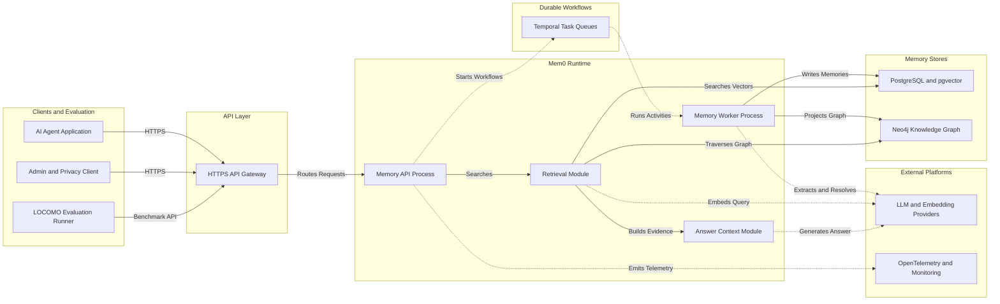
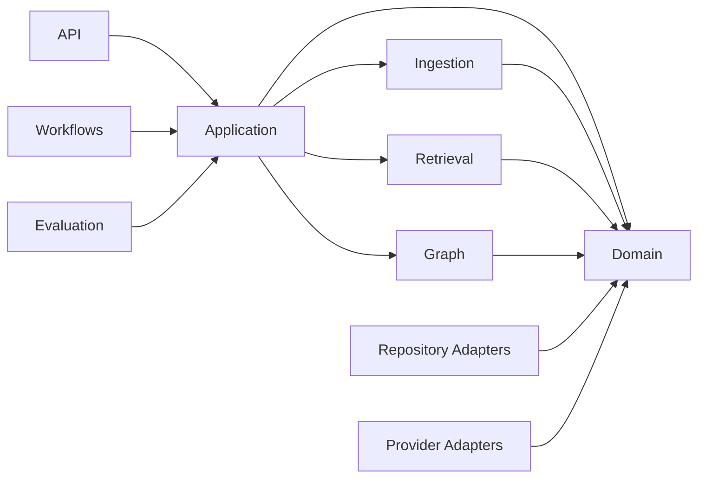
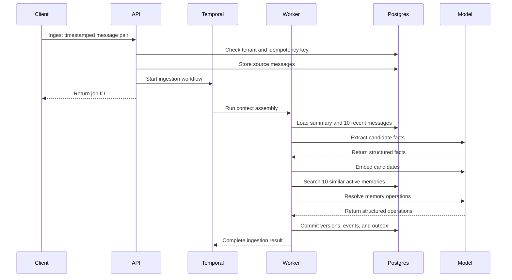
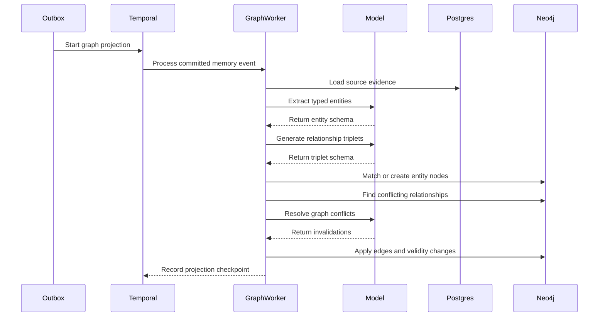
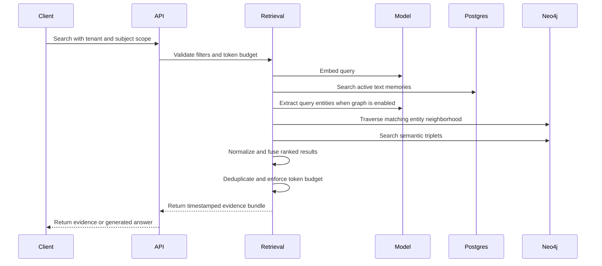
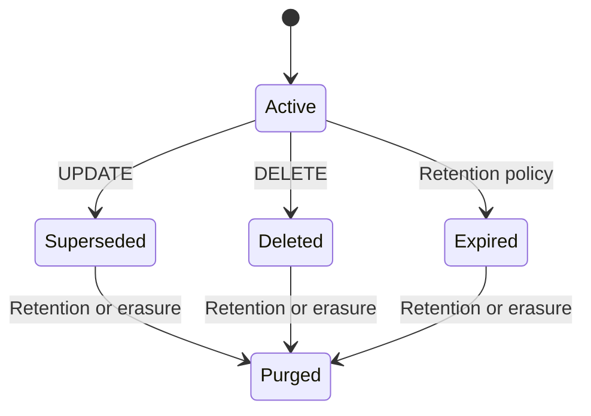
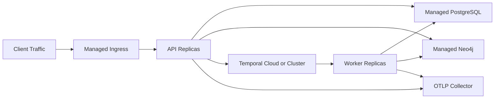

# Mem0 Implementation Architecture

## 1. Purpose and authority

This document is the implementation reference for the Mem0 paper
reimplementation. It defines the target system structure, deployable units,
module boundaries, data ownership, runtime flows, failure behavior, and
technology choices.

Use the documents in this order:

1. [`PRD.md`](PRD.md) defines product behavior, requirements, and acceptance
   criteria.
2. This file defines how the system is structured to satisfy those requirements.
3. Architecture Decision Records (ADRs), when added under `docs/adr/`, explain
   later deviations or refinements.
4. Source code and tests implement and verify these contracts.

When code and this document disagree, either correct the code or update this
document through an explicit architecture decision. Do not allow undocumented
architecture drift.

| Field | Value |
|---|---|
| Status | Target architecture; implementation not started |
| Version | 1.0 |
| Date | 2026-07-31 |
| Product requirements | [`docs/PRD.md`](PRD.md) |
| Research source | [`mem0paper.pdf`](../mem0paper.pdf) |
| Editable visual | [Mem0 System Architecture in FigJam](https://www.figma.com/board/npXadicYwJDf7Mrh8C8uln) |

## 2. Architectural goals

The architecture must:

- reproduce the April 2025 Mem0 and Mem0g algorithms without depending on the
  upstream `mem0ai` implementation;
- keep research behavior reproducible while allowing production hardening;
- make tenant and subject isolation impossible to bypass accidentally;
- preserve source evidence, timestamps, versions, and mutation history;
- keep online retrieval latency independent of total conversation length;
- make LLM providers, embedding providers, vector indexing, and graph memory
  replaceable behind stable interfaces;
- support idempotent replay of long-running ingestion operations;
- allow text memory to ship before graph memory;
- provide evaluation, token, latency, and cost measurements as first-class
  outputs.

## 3. Core invariants

These rules apply across all modules:

1. Every read and write includes `tenant_id` and a subject scope such as
   `user_id`, `agent_id`, or `run_id`.
2. Scope filters are applied inside repository queries before ranking or result
   truncation.
3. Every memory retains source message IDs and model/prompt provenance.
4. Event time, ingestion time, and validity time are separate values.
5. LLM output is untrusted until validated against a strict schema.
6. LLMs propose facts and operations; deterministic code enforces permissions,
   identifiers, state transitions, and transaction boundaries.
7. Active search never returns deleted, superseded, expired, or invalid facts.
8. Text memory is authoritative for the Mem0 pipeline. The graph is an
   asynchronously maintained projection used by Mem0g.
9. Graph failure must not roll back a successfully committed text memory.
10. Prompt, model, embedding, schema, and threshold versions are recorded with
    every generated artifact.
11. Research and production profiles share domain code but use separate,
    explicit configuration.
12. Raw conversation content and secret values are not written to ordinary
    logs, metrics, or traces.

## 4. System context



### 4.1 Architectural style

The first implementation is a **modular monolith with multiple process
entrypoints**, not a microservice fleet.

All domain and application modules live in one Python package. They are deployed
as independently scalable processes:

- an API process for synchronous HTTP requests;
- a worker process for Temporal workflows and activities;
- an evaluation CLI/worker for LOCOMO and regression runs.

This keeps transactions, contracts, and local development simple while
preserving module boundaries that allow later extraction into services if
measured load requires it.

## 5. Deployable units

| Unit | Responsibility | Scaling signal | Must not do |
|---|---|---|---|
| API process | Authentication context, request validation, idempotency lookup, synchronous search, job/status APIs | HTTP concurrency and latency | Run long LLM ingestion workflows in-process |
| Worker process | Ingestion, extraction, resolution, summaries, graph projection, re-embedding, erasure | Temporal queue depth and activity latency | Expose public HTTP endpoints |
| Evaluation runner | Dataset import, baseline runs, metrics, benchmark reports | Explicit batch jobs | Mutate production tenant data |
| PostgreSQL | Transactional source of truth for conversations, text memories, vectors, events, workflow metadata, and outbox | Query latency, storage, index recall | Store graph traversal structure |
| Neo4j | Optional Mem0g entity and relationship projection | Graph query latency and graph size | Become the source of truth for raw messages or text memory |
| Temporal | Durable workflow history, retries, schedules, and task queues | Queue age and workflow backlog | Store product-domain records |
| OTLP collector | Receive traces and metrics and export them to monitoring backends | Export failures and queue size | Receive raw memory text |

## 6. Code and dependency boundaries

The intended repository structure is:

```text
src/memory_service/
|-- api/                 # HTTP routes, auth context, request/response schemas
|-- application/         # Use cases and transaction orchestration
|-- domain/              # Entities, value objects, policies, repository ports
|-- ingestion/           # Context assembly, extraction, reconciliation
|-- retrieval/           # Text search, graph search, fusion, token budgeting
|-- graph/               # Entity linking, relationships, conflict projection
|-- prompts/             # Versioned prompt manifests and output schemas
|-- providers/           # LLM, embedding, tokenization adapters
|-- repositories/        # PostgreSQL, pgvector, and Neo4j implementations
|-- workflows/           # Temporal workflows and replay-safe activities
|-- telemetry/           # Tracing, metrics, redaction, cost accounting
`-- config/              # Validated research and production configuration

evals/
|-- locomo/              # Dataset import and benchmark orchestration
|-- baselines/           # Full-context and fixed-chunk RAG baselines
|-- metrics/             # F1, BLEU-1, judge, latency, and token metrics
`-- reports/             # Generated, versioned evaluation outputs
```

Dependency direction:



Rules:

- `domain` imports no web framework, ORM, database driver, model SDK, Temporal
  SDK, or telemetry vendor.
- `application` depends on domain ports, never concrete repositories.
- `api` and `workflows` are inbound adapters that call application use cases.
- `repositories` and `providers` are outbound adapters implementing domain
  ports.
- `retrieval` may combine repository results but may not bypass repository
  scope enforcement.
- evaluation code may use public application interfaces and dedicated fixtures;
  it must not import private database implementation details.

## 7. Runtime flows

### 7.1 Message ingestion and text-memory reconciliation



Required transaction behavior:

1. Source messages are stored once under the request idempotency key.
2. Candidate extraction can retry without duplicating messages.
3. The final text-memory batch, memory events, and outbox events commit in one
   PostgreSQL transaction.
4. Resolver-produced target IDs are rejected unless they belong to the same
   tenant/subject scope and are still active.
5. Optimistic-lock conflict causes a fresh similarity lookup and resolution
   attempt.
6. Exhausted retries leave an inspectable failed job and dead-letter event; no
   partial memory batch is published.

### 7.2 Asynchronous conversation summaries

Summary refresh is a separate workflow:

1. An ingestion transaction emits a summary-refresh outbox event when a session
   ends or 20 uncovered messages accumulate.
2. The dispatcher starts or signals one summary workflow per conversation.
3. The worker loads the previous summary and uncovered messages.
4. The model produces a new versioned summary.
5. PostgreSQL stores the summary with its covered message range and
   prompt/model metadata.
6. Failed refreshes keep the previous successful summary active and retry
   independently of ingestion.

### 7.3 Graph projection



Projection rules:

- the outbox event ID is the graph-projection idempotency key;
- entity identity uses exact canonical/alias matching followed by embedding
  similarity;
- the initial entity similarity candidate threshold is `0.78`, configurable by
  entity type;
- old conflicting edges are marked invalid with validity metadata, not
  physically deleted;
- Neo4j stores source memory/message IDs for every node and relationship;
- projection checkpoints allow the graph to be rebuilt from PostgreSQL events;
- text memory remains available if graph projection is delayed or unavailable.

### 7.4 Search and answer-context assembly



Retrieval rules:

- text-only Mem0 uses dense similarity over active memories;
- Mem0g adds entity-centric traversal and semantic triplet search;
- online graph traversal defaults to one hop and is capped at two;
- text, entity, and triplet rankings use reciprocal-rank fusion in the initial
  implementation;
- graph and triplet thresholds are configuration values and are recorded in
  evaluation output;
- results are ordered and trimmed only after tenant/subject filtering;
- production responses include memory IDs and evidence metadata;
- benchmark answer generation is limited to six words.

### 7.5 Manual correction and erasure

Manual correction creates the same version and audit events as an automated
update. It never edits memory text in place.

Erasure is a durable workflow that:

1. prevents new writes for the target subject;
2. identifies raw messages, summaries, text memories, embeddings, graph
   entities/relationships, caches, and queued artifacts;
3. removes or cryptographically renders inaccessible each artifact;
4. records redacted completion evidence;
5. verifies that ordinary search returns no subject data;
6. releases the write block or leaves an actionable failed state.

## 8. Domain model and data ownership

### 8.1 PostgreSQL source-of-truth aggregates

| Aggregate | Owner module | Important invariants |
|---|---|---|
| Conversation | ingestion | Ordered sessions/messages, event and ingestion time, tenant scope |
| Summary | ingestion | Immutable versions, covered message range, one active version |
| Memory | domain/application | Immutable versions, active lineage head, provenance, validity state |
| Memory event | application | Append-only operation record with prompt/model/config versions |
| Workflow job | workflows/application | Idempotency key, attempts, terminal result or failure |
| Outbox event | application | Written in the same transaction as its domain change |
| Audit event | application | Append-only, actor and request metadata, redacted content |

Memory states:



Only `Active` memories are eligible for ordinary retrieval.

### 8.2 Neo4j projection

Entity nodes contain:

- tenant and subject scope;
- canonical name and aliases;
- entity type;
- embedding and embedding version;
- source memory/message IDs;
- creation time and status.

Relationship edges contain:

- canonical relation label and textual triplet encoding;
- embedding and embedding version;
- confidence and source IDs;
- event time, `valid_from`, and `valid_to`;
- active/invalid status and invalidation provenance.

Neo4j data is rebuildable. PostgreSQL memory and event records are not.

## 9. Public interfaces

The HTTP API is versioned under `/v1`.

| Interface | Execution model | Owner |
|---|---|---|
| `POST /conversations/{id}/messages:ingest` | Asynchronous, returns job ID | ingestion |
| `GET /jobs/{job_id}` | Synchronous status read | workflows |
| `POST /memories:search` | Synchronous | retrieval |
| `POST /memory-context` | Synchronous | retrieval |
| `POST /answers` | Synchronous retrieval plus model call | retrieval |
| `GET /memories/{memory_id}` | Synchronous | application |
| `PATCH /memories/{memory_id}` | Asynchronous audited update | application |
| `DELETE /memories/{memory_id}` | Asynchronous audited invalidation | application |
| `POST /subjects:export` | Asynchronous | application |
| `POST /subjects:erase` | Asynchronous durable workflow | workflows |
| `GET /health/live` | Synchronous process health | api |
| `GET /health/ready` | Synchronous dependency readiness | api |

Interface rules:

- external identifiers are opaque;
- requests carry an idempotency key for every mutation;
- authentication middleware resolves a principal and tenant before handlers run;
- HTTP handlers do not contain domain decisions;
- error responses use stable machine-readable codes and a request ID;
- provider errors are translated into retryable/non-retryable application
  failures;
- job responses expose progress and final operation IDs without leaking prompt
  content or chain-of-thought.

## 10. Provider ports

The domain/application layer defines these provider interfaces:

```text
LanguageModel
|-- generate_structured(task, prompt_version, schema, input, settings)
`-- generate_text(task, prompt_version, input, settings)

EmbeddingModel
|-- embed_texts(texts, model_version, dimensions)
`-- embed_query(query, model_version, dimensions)

Tokenizer
|-- count(text, encoding)
`-- trim(items, token_budget, encoding)

TextMemoryRepository
GraphMemoryRepository
ConversationRepository
SummaryRepository
WorkflowRepository
AuditRepository
```

Provider adapters must return normalized usage data:

- provider and model snapshot;
- request ID;
- input/output tokens;
- retry count;
- latency;
- estimated or reported cost;
- schema validation result.

Research runs pin the model snapshot and configuration. Production may switch
providers only through configuration and a passing regression evaluation.

## 11. Configuration profiles

### 11.1 Research profile

| Setting | Value |
|---|---|
| Extraction/resolution model | Pinned `gpt-4o-mini` snapshot |
| Embedding model | `text-embedding-3-small` |
| Temperature | `0` |
| Recent message window `m` | `10` |
| Similar memory count `s` | `10` |
| Text retrieval | Dense semantic similarity |
| Entity candidate threshold | Initial `0.78`, calibrated on development data |
| Triplet threshold | Initial `0.70`, calibrated on development data |
| Graph traversal | One hop, maximum two |
| Ranking fusion | Reciprocal-rank fusion |
| Judge runs | `10` per method |

Research configuration is immutable within a benchmark run and is saved with
the generated report.

### 11.2 Production profile

Production configuration may add:

- provider failover;
- per-tenant quotas and retention;
- graph-memory enablement;
- cost ceilings;
- index tuning;
- rate limits;
- region and data-residency controls.

Production-only retrieval enhancements must remain feature-flagged so the
paper-faithful research path continues to run unchanged.

## 12. Storage and transaction strategy

### 12.1 PostgreSQL and pgvector

PostgreSQL stores relational records and vectors in the same database so memory
updates, provenance, audit metadata, and outbox events can share transactions.

Initial indexing:

- B-tree indexes for tenant, subject, status, category, and time filters;
- unique tenant/idempotency index for mutation requests;
- HNSW cosine index for active embeddings;
- exact-search fallback for small or highly filtered scopes;
- embedding-version partition or predicate to prevent mixed-model comparison.

Filtered approximate-nearest-neighbor recall must be measured. If an ANN query
returns too few scoped results, retrieval retries with a larger search window
or exact search.

### 12.2 Neo4j

Neo4j owns graph traversal and relationship-vector queries. It does not accept a
write without tenant/subject scope and source evidence.

The Python driver is isolated in the graph repository adapter. Cypher queries
are parameterized and covered by integration tests. Graph schema and vector
index creation are migration-controlled.

### 12.3 Transactional outbox

The outbox bridges PostgreSQL commits to asynchronous workflows:

1. a domain change and outbox row commit together;
2. a dispatcher reads undispatched rows with locking;
3. it starts or signals the Temporal workflow using the outbox ID;
4. successful dispatch records the Temporal workflow ID;
5. replaying dispatch is safe because workflow IDs and activities are
   idempotent.

## 13. Workflow and retry strategy

Temporal workflows contain orchestration only. Network, database, model, and
filesystem operations run in activities.

Activity requirements:

- explicit start-to-close timeout;
- bounded exponential retry with jitter;
- non-retryable classification for invalid schema, authorization, and
  unsupported configuration;
- idempotency key passed to every external mutation;
- heartbeats for large evaluation or erasure activities;
- no secrets or raw memory text in workflow search attributes.

Workflow names are stable public operational contracts:

- `ingest-conversation-pair`;
- `refresh-conversation-summary`;
- `project-graph-memory`;
- `reembed-memory-scope`;
- `erase-memory-subject`;
- `run-locomo-evaluation`.

## 14. Observability

OpenTelemetry spans cross API, Temporal, provider, and repository boundaries.

Required span attributes:

- request/workflow ID;
- tenant ID in a one-way-hashed or approved non-sensitive form;
- operation type;
- prompt/model/embedding version;
- attempt number;
- token counts;
- result count;
- latency and error class.

Required metrics:

- API and workflow latency histograms;
- extraction candidates per message pair;
- `ADD`, `UPDATE`, `DELETE`, and `NOOP` counts;
- schema-validation and provider retry rates;
- vector empty-result and exact-fallback rates;
- graph entities/edges created, reused, and invalidated;
- queue depth and oldest task age;
- model tokens and estimated cost;
- benchmark scores by category and commit.

Telemetry processors redact message and memory content before export.

## 15. Security and privacy architecture

- TLS is required for every network connection.
- Secrets come from a secret manager or local development environment, never
  source control.
- Repository methods require a scope object; there are no unscoped search
  methods in production code.
- Administrative mutation and erasure require elevated authorization.
- Conversation content is delimited as untrusted data in prompts.
- Structured-output schemas and deterministic target-ID checks limit prompt
  injection impact.
- Logs and workflow metadata contain identifiers and counts, not raw content.
- Backups, exports, and dead-letter payloads follow the same encryption and
  retention rules as primary data.

## 16. Deployment topology

### 16.1 Local development

Docker Compose provides:

- PostgreSQL with pgvector;
- Neo4j;
- Temporal server and UI;
- OTLP collector;
- Prometheus and Grafana.

API, worker, and evaluation processes run from the same Python environment.
Provider calls may use recorded fakes for deterministic tests.

### 16.2 Production



API and workers scale independently. Databases use managed backups and
point-in-time recovery where available. Production readiness requires tested
restore, erasure, and graph-rebuild procedures.

## 17. Testing boundaries

| Test layer | What it verifies |
|---|---|
| Domain unit tests | Memory state transitions, scope rules, temporal logic, token budgeting |
| Prompt contract tests | Structured schemas, extraction policy, conflict cases, injection resistance |
| Repository integration tests | PostgreSQL transactions, pgvector filtering/recall, Neo4j validity behavior |
| Workflow tests | Retries, replay safety, idempotency, dead-letter behavior |
| API contract tests | Authentication context, request/response schemas, stable errors |
| End-to-end tests | Ingest, retrieve, update, graph projection, correction, export, erasure |
| Evaluation tests | LOCOMO import, baselines, metrics, variance, latency, and token reporting |

No provider, prompt, threshold, index, or ranking change can merge without
running the affected regression set. Release gates remain defined by the PRD.

## 18. Implementation order

Build in this dependency order:

1. project skeleton, configuration, domain types, and provider/repository ports;
2. PostgreSQL schema, migrations, and transactional repositories;
3. LOCOMO importer, metrics, and baseline evaluation harness;
4. message ingestion, context assembly, and structured fact extraction;
5. embedding search and four-way memory resolution;
6. synchronous search and evidence-bundle APIs;
7. Temporal workflows, outbox dispatch, retries, and summary refresh;
8. Neo4j graph projection and conflict invalidation;
9. entity/triplet retrieval and rank fusion;
10. administrative correction, export, and erasure;
11. observability, load tests, failure tests, and production runbooks.

Do not begin graph-memory implementation before text-memory evaluation and
versioning behavior are stable.

## 19. Architecture decisions

These decisions are locked for the initial implementation:

| ID | Decision | Reason |
|---|---|---|
| AD-001 | Modular monolith with API, worker, and evaluation entrypoints | Preserves boundaries without premature distributed complexity |
| AD-002 | PostgreSQL plus pgvector is the text-memory source of truth | Transactions, provenance, filters, and vectors stay consistent |
| AD-003 | Neo4j is an optional rebuildable graph projection | Matches the paper and isolates graph complexity |
| AD-004 | Temporal coordinates durable background work | LLM calls and cross-store projection require replay-safe retries |
| AD-005 | Provider SDKs remain behind domain ports | Research pinning and production replacement remain possible |
| AD-006 | Memory records are immutable versions with soft invalidation | Auditability and temporal reasoning require history |
| AD-007 | Graph updates are eventually consistent with text memory | Graph outages must not block core memory ingestion |
| AD-008 | No LangChain or LangGraph in the core pipeline | The state machine is explicit and small |
| AD-009 | Research behavior is a permanent configuration profile | Later enhancements must not erase reproducibility |

Any change to these decisions requires an ADR and updates to this file before
implementation.

## 20. Updating this document

Update the architecture when:

- a deployable unit is added, removed, or split;
- a datastore, workflow engine, or provider contract changes;
- data ownership or transaction boundaries change;
- a public API or domain state transition changes;
- a new cross-module dependency is introduced;
- deployment, security, privacy, or recovery behavior changes.

Every architecture update should include:

1. the reason for the change;
2. affected requirements and modules;
3. migration and compatibility impact;
4. test and rollout impact;
5. an ADR when the change reverses or extends a locked decision.

## 21. Known future extensions

The following are intentionally outside the initial architecture:

- the upstream April 2026 ADD-only extraction algorithm;
- BM25/entity multi-signal retrieval;
- multimodal and procedural memory;
- per-tenant physical database isolation;
- a public web dashboard;
- automatic graph ontology learning;
- foundation-model fine-tuning.

These may be added only after the paper-faithful baseline passes evaluation and
the architecture change process is followed.
