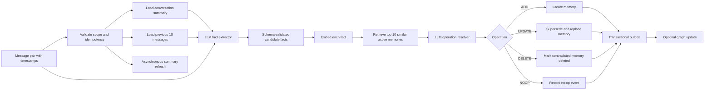
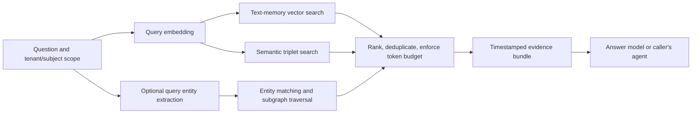

# Product Requirements Document: Mem0 Paper Reimplementation

## 1. Document control

| Field | Value |
|---|---|
| Product | Mem0-compatible long-term memory service |
| Document status | Draft for implementation |
| Version | 1.0 |
| Date | 2026-07-30 |
| Primary source | [Local paper](../mem0paper.pdf) |
| Canonical paper version | [arXiv:2504.19413v1](https://arxiv.org/abs/2504.19413) |
| Intended audience | Product, ML, backend, platform, security, and QA engineers |

Normative terms such as **MUST**, **SHOULD**, and **MAY** indicate requirement
strength. Paper page references refer to the page number printed in the PDF.

## 2. Executive summary

The product is a multi-tenant long-term memory service for conversational AI
agents. It will incrementally convert new user/assistant exchanges into concise
memories, reconcile those memories against prior knowledge, retrieve only
question-relevant information, and optionally maintain a temporal knowledge
graph.

The implementation has two modes:

1. **Mem0 text memory**, the first production milestone. It uses conversation
   summaries and recent turns to extract salient facts, then chooses one of
   `ADD`, `UPDATE`, `DELETE`, or `NOOP` after comparing each fact with similar
   stored memories.
2. **Mem0g graph memory**, an extension that represents entities as nodes and
   relationships as directed, labeled edges. It augments text retrieval with
   entity-centric subgraph traversal and semantic triplet search.

The service must expose stable APIs for ingestion, memory search, answer
context assembly, administration, and erasure. It must also ship with a
reproducible LOCOMO evaluation harness so quality, latency, and token usage can
be measured before release.

## 3. Scope boundary and interpretation

### 3.1 Canonical behavior

The April 2025 paper is the behavioral specification for this project:

- Mem0 extraction and four-way update flow: pages 3-5 and Appendix B.
- Mem0g entity, relation, conflict, and retrieval flow: pages 5-6.
- LOCOMO evaluation and baselines: pages 6-14.
- Answer-generation and judge prompt requirements: Appendix A.

The current [upstream Mem0 repository](https://github.com/mem0ai/mem0) announced
a materially different algorithm in April 2026: ADD-only extraction,
multi-signal retrieval, entity linking, and temporal ranking. Those changes are
not part of the paper-faithful MVP. They may be evaluated later behind feature
flags.

The upstream `mem0ai` package MUST NOT be used to implement the core algorithm,
because doing so would make this a wrapper around a moving implementation
rather than a reproduction. It MAY be used as an external comparison baseline.

### 3.2 Paper fidelity versus production hardening

The paper omits several production requirements. This PRD adds tenant
isolation, idempotency, provenance, audit history, access control, erasure,
observability, retries, and soft deletion. These additions must not change
retrieval results in the research-fidelity configuration.

Two runtime profiles are required:

- **Research profile:** pinned models and prompts, deterministic settings,
  LOCOMO-compatible ingestion, fixed `m=10` recent messages and `s=10` similar
  memories, and recorded environment metadata.
- **Production profile:** configurable providers and thresholds, durable
  workflows, privacy controls, autoscaling, and operational SLOs.

## 4. Problem statement

LLM context windows are finite and become slower and more expensive as complete
conversation history grows. Raw-history RAG also returns noisy text blocks
instead of compact, reconciled knowledge. Agents consequently forget user
preferences, repeat questions, use stale facts, or fail to reason across
sessions.

The product must provide persistent memory whose query-time cost is bounded by
the number of relevant memories, rather than total conversation length.

## 5. Goals

### 5.1 Product goals

- Preserve salient facts, preferences, events, and relationships across
  conversation sessions.
- Keep stored knowledge coherent when new messages augment or contradict prior
  information.
- Return relevant, timestamped memories with source provenance.
- Support temporal and relational reasoning without sending full history to the
  answer model.
- Make memory behavior inspectable, testable, reversible, and safe for
  multi-tenant production use.
- Reproduce the paper's quality/cost/latency trade-off on LOCOMO within the
  tolerances defined in Section 16.

### 5.2 Non-goals for the first release

- General document RAG, web search, or enterprise knowledge-base indexing.
- Multimodal memory.
- Procedural/skill memory or reinforcement learning.
- Training or fine-tuning foundation models.
- Reproducing every third-party baseline from the paper.
- A consumer chat UI.
- Exact numerical equality with the paper on different hardware or unpinned
  model versions.
- The upstream April 2026 ADD-only algorithm.

## 6. Users and principal use cases

| User | Need |
|---|---|
| Agent application developer | Add memory to an existing assistant through a small API/SDK surface. |
| End user | Have an agent remember current preferences and past events without exposing another user's data. |
| ML/evaluation engineer | Reproduce LOCOMO runs and compare prompt/model/retrieval variants. |
| Operations engineer | Observe latency, cost, failures, queues, index health, and model-provider behavior. |
| Privacy administrator | Export, correct, expire, and erase a subject's memories and provenance. |

Primary use cases:

1. A user expresses or changes a preference; future sessions use the latest
   valid preference.
2. A question depends on facts spread across multiple sessions.
3. A question requires resolving a relative time expression against the
   original message timestamp.
4. A relational question requires following connections among people, places,
   events, and dates.
5. A user requests deletion or correction of stored memory.

## 7. Product principles

- **Evidence before inference:** every memory must retain source message IDs.
- **Time is first-class:** event time, ingestion time, and validity time must
  remain distinct.
- **No cross-scope retrieval:** tenant and subject filters are mandatory, not
  best-effort post-filters.
- **LLMs propose; code enforces:** models may extract facts and select
  operations, but schemas, permissions, state transitions, and referential
  integrity are enforced deterministically.
- **Version everything:** prompts, models, embeddings, schemas, and thresholds
  must be recorded with each operation.
- **Benchmark before optimization:** paper fidelity is established before later
  upstream enhancements are introduced.

## 8. High-level architecture

### 8.1 Ingestion and reconciliation



### 8.2 Retrieval and answer-context assembly



### 8.3 Logical components

- API service
- Ingestion/workflow worker
- Summary worker
- LLM and embedding provider adapters
- Text memory repository and vector index
- Optional graph memory repository
- Retrieval/ranking service
- Evaluation runner
- Audit, metrics, and tracing pipeline

## 9. Delivery scope

### Phase 0 - Reproducibility foundation

- Import LOCOMO and preserve session timestamps, speaker IDs, dialog IDs,
  questions, categories, answers, and evidence references.
- Implement common model, prompt, token, and latency logging.
- Implement F1, BLEU-1, and LLM-as-a-Judge evaluation.
- Add full-context and fixed-chunk RAG reference baselines.

### Phase 1 - Mem0 text memory MVP

- Incremental message-pair ingestion.
- Global conversation summary plus 10-message recency context.
- Salient fact extraction.
- Dense embeddings and top-10 similar memory lookup.
- Four-way update resolver.
- Text-memory retrieval and evidence-bundle generation.
- Search, inspect, update, delete, and erase APIs.

### Phase 2 - Mem0g

- Typed entity extraction.
- Directed labeled relationship generation.
- Entity deduplication through embedding similarity.
- Relationship conflict detection and invalidation.
- Entity-centric traversal and semantic triplet retrieval.
- Fusion of text and graph evidence.

### Phase 3 - Production hardening

- Durable workflows and replay-safe activities.
- Rate limiting, quotas, encryption, retention, and audit export.
- Autoscaling, dashboards, alerts, load tests, and disaster recovery.
- Provider failover and cost controls.

## 10. Functional requirements

### 10.1 Identity, scope, and tenancy

**FR-ID-001** Every write and read MUST include `tenant_id` and at least one
memory subject scope: `user_id`, `agent_id`, or `run_id`.

**FR-ID-002** Database queries and vector searches MUST apply scope before
ranking. A result from another tenant or subject is a release-blocking defect.

**FR-ID-003** External IDs MUST be opaque strings. Internal primary keys SHOULD
be UUIDv7 or another time-sortable, collision-resistant identifier.

**FR-ID-004** Ingestion MUST accept an idempotency key. Replaying the same
tenant/key/payload MUST return the original result without duplicate messages,
memories, graph elements, or billable LLM calls.

### 10.2 Conversation ingestion

**FR-ING-001** The service MUST accept ordered messages with role, speaker ID,
content, event timestamp, conversation ID, session ID, and caller metadata.

**FR-ING-002** The paper-faithful path MUST process a completed interaction pair
consisting of the current message and its immediately preceding message.

**FR-ING-003** The service MUST preserve original text and timestamps for
provenance but MUST NOT expose raw history in search results unless explicitly
authorized.

**FR-ING-004** Late and out-of-order messages MUST be accepted. They MUST be
ordered by event time for temporal reasoning while retaining ingestion time for
audit.

**FR-ING-005** A successful ingestion response MUST return a workflow/job ID,
the source message IDs, and final memory-operation results. Synchronous waiting
MAY be supported with a timeout; durable processing remains authoritative.

**FR-ING-006** An ingestion operation MUST be atomic from the caller's
perspective. Partial LLM or storage failures must be retried or reported without
publishing a partially applied memory batch.

### 10.3 Conversation summary

**FR-SUM-001** The system MUST maintain a versioned global summary per
conversation.

**FR-SUM-002** Summary generation MUST run independently of the critical
ingestion path, as required by the paper.

**FR-SUM-003** Until a refreshed summary is ready, extraction MUST use the most
recent successful summary rather than block ingestion.

**FR-SUM-004** Because the paper does not specify refresh cadence, the initial
default is session boundary or every 20 new messages, whichever occurs first.
This value MUST be configurable and benchmarked.

**FR-SUM-005** Each summary MUST store covered message range, prompt version,
model snapshot, token counts, generation time, and creation timestamp.

### 10.4 Candidate fact extraction

**FR-EXT-001** The extraction prompt MUST combine:

- the current conversation summary;
- the previous `m=10` messages in research mode;
- the new message pair;
- speaker identities and absolute timestamps.

**FR-EXT-002** The extractor MUST return zero or more schema-valid candidate
facts. Each candidate MUST include normalized natural-language text, subject,
source message IDs, event/validity time when known, and a category such as
preference, profile fact, event, plan, relationship, or other.

**FR-EXT-003** The extractor MUST prefer durable and potentially useful facts.
Greetings, transient filler, model instructions embedded in user content,
secrets with no approved retention purpose, and unsupported speculation MUST
not become memories.

**FR-EXT-004** Relative time expressions MUST be normalized to absolute dates or
ranges when the source timestamp makes that possible. The original expression
MUST remain in provenance.

**FR-EXT-005** The model output MUST use strict structured output/function
calling and be validated by Pydantic. Invalid output receives bounded retries
and then a dead-letter record; it must never be written directly to a database.

**FR-EXT-006** Prompt and model snapshot IDs MUST be recorded. Prompts MUST be
regression-tested against a curated extraction set.

### 10.5 Embeddings and similarity

**FR-EMB-001** Each candidate and stored memory MUST have an embedding generated
by a configurable provider adapter.

**FR-EMB-002** The research profile SHOULD use `text-embedding-3-small` to match
the paper. Model name, dimensions, normalization behavior, and embedding
version MUST be stored.

**FR-EMB-003** Re-embedding after a model change MUST use a shadow index and an
atomic alias/index switch. Mixed embeddings MUST NOT be compared.

**FR-EMB-004** For each candidate fact, the research profile MUST retrieve
`s=10` semantically similar active memories within the same scope.

**FR-EMB-005** Similarity scores are diagnostic inputs, not final conflict
decisions. The LLM resolver must see the candidate and retrieved memory text,
IDs, and timestamps.

### 10.6 Four-way memory resolver

**FR-RES-001** For every candidate, the resolver MUST choose exactly one of:

- `ADD`: no semantically equivalent memory exists;
- `UPDATE`: replace a related memory with a richer or corrected formulation;
- `DELETE`: new evidence contradicts an existing memory and does not itself
  require a replacement memory;
- `NOOP`: duplicate, irrelevant, unsupported, or not richer.

**FR-RES-002** The resolver MUST return a strict schema containing operation,
target memory ID when required, final memory text when required, a concise
decision rationale, and confidence.

**FR-RES-003** `UPDATE` and `DELETE` MUST reference an existing active memory
returned in the resolver context. Code must reject invented or cross-scope IDs.

**FR-RES-004** An update MUST preserve the original memory record, create a new
version, and link them through `supersedes_id`. Only the new version is active.
This is the auditable equivalent of the paper's replacement behavior.

**FR-RES-005** A delete MUST mark the target memory deleted and remove it from
active search. Physical purge follows retention policy or an authorized erasure
request.

**FR-RES-006** A no-op MUST not change active memory but SHOULD retain an
operation event for evaluation and debugging.

**FR-RES-007** Concurrent updates to the same memory MUST use optimistic
locking. On conflict, similarity lookup and resolution MUST be rerun against
the latest state.

**FR-RES-008** A memory batch MUST be deterministic under recorded inputs,
prompt/model versions, and random seed where supported. Research temperature
MUST be zero.

### 10.7 Text-memory retrieval

**FR-RET-001** Search MUST accept natural-language query, scope filters, `top_k`,
minimum score, time range, categories, and token budget.

**FR-RET-002** The default paper-faithful search MUST use dense semantic
similarity over active natural-language memories.

**FR-RET-003** Results MUST include memory ID, text, relevance score, subject,
event/validity time, creation time, source message IDs, and version state.

**FR-RET-004** The retrieval service MUST deduplicate equivalent memories and
enforce a configurable context token budget before returning evidence.

**FR-RET-005** Deleted, superseded, expired, or invalid graph facts MUST not be
returned unless an authorized audit query explicitly requests historical data.

**FR-RET-006** Hybrid keyword/entity ranking is a post-MVP experiment and MUST
be feature-flagged so paper-faithful evaluation remains available.

### 10.8 Answer-context assembly

**FR-ANS-001** The service MUST be able to return an evidence bundle without
calling an answer model, allowing any agent framework to consume the memory
layer.

**FR-ANS-002** An optional `/answer` endpoint MUST instruct the model to rely on
provided memories, prioritize the most recent valid evidence when facts
conflict, normalize relative time references, and keep benchmark answers
to no more than six words.

**FR-ANS-003** Speaker names mentioned inside a memory MUST not be confused with
the subject who owns or supplied that memory.

**FR-ANS-004** Answers SHOULD include cited memory IDs in production mode.
LOCOMO benchmark mode MAY return only the concise answer required by the
evaluation.

**FR-ANS-005** If evidence is insufficient, production mode MUST return an
explicit `insufficient_evidence` state rather than invent an answer.

### 10.9 Graph memory (Mem0g)

**FR-GR-001** Graph memory MUST be optional per tenant and enabled independently
from text memory.

**FR-GR-002** The entity extractor MUST return normalized entity name, type,
source spans/messages, aliases, embedding, and creation timestamp. Initial
types include Person, Location, Organization, Event, Date/Time, Object,
Preference, Activity, and Concept.

**FR-GR-003** The relationship generator MUST return directed triplets
`(source_entity, relation, destination_entity)` with source evidence,
event/validity time, confidence, and normalized relation label.

**FR-GR-004** For each endpoint of a new triplet, the system MUST use embedding
similarity and exact/alias keys to locate an existing node. It may create zero,
one, or two new nodes before adding the edge.

**FR-GR-005** The paper leaves entity threshold `t` unspecified. The initial
candidate default is cosine similarity `0.78`; it MUST be calibrated on a
held-out set and configurable by entity type.

**FR-GR-006** A conflict detector MUST identify existing relationships that may
be contradicted by the new triplet. An LLM resolver decides whether an old
relationship becomes invalid.

**FR-GR-007** Contradicted graph edges MUST be invalidated, not physically
removed, preserving `valid_from`, `valid_to`, `invalidated_by`, and provenance
for temporal reasoning.

**FR-GR-008** Entity-centric retrieval MUST:

1. extract query entities;
2. map them to graph nodes;
3. traverse bounded incoming and outgoing relationships;
4. return a relevance-ranked subgraph.

**FR-GR-009** Semantic triplet retrieval MUST embed the complete query, compare
it with textual encodings of graph triplets, apply a configurable relevance
threshold, and return results in decreasing similarity order.

**FR-GR-010** Text, entity-centric, and triplet results MUST be normalized and
fused. Reciprocal-rank fusion is the initial deterministic default because the
paper does not specify a fusion formula. Weights MUST be configuration, not
prompt constants.

**FR-GR-011** Graph traversal depth MUST default to one hop and be capped at two
hops for online requests unless explicitly authorized. Token and node/edge
budgets must be enforced.

### 10.10 Administration and privacy

**FR-ADM-001** Authorized clients MUST be able to inspect, correct, invalidate,
export, and erase memories.

**FR-ADM-002** Erasure MUST remove or cryptographically render inaccessible raw
messages, summaries, text memories, embeddings, graph entities/edges, caches,
and queued artifacts for the requested subject, subject to documented legal
retention rules.

**FR-ADM-003** Every mutation MUST produce an immutable audit event containing
actor, scope, operation, target, timestamp, and request ID, without logging
secret content.

**FR-ADM-004** Retention and expiration MAY be configured by tenant, category,
or memory. Expired records are excluded from retrieval and later purged.

## 11. Data model

### 11.1 Relational/vector store

| Entity | Required fields |
|---|---|
| `tenants` | `id`, status, policy/config references, created time |
| `conversations` | `id`, `tenant_id`, subject scopes, status, created/updated time |
| `sessions` | `id`, `conversation_id`, sequence, start/end event time |
| `messages` | `id`, conversation/session, role, speaker, content/ciphertext, event time, ingestion time, source metadata, content hash |
| `summaries` | `id`, conversation, version, text, covered message range, model/prompt version, token usage, status |
| `memories` | `id`, scope, normalized text, category, status, event/validity time, version, `supersedes_id`, optimistic-lock version |
| `memory_sources` | memory-to-message link, source span/role, extraction confidence |
| `memory_embeddings` | memory ID, provider/model/dimensions, vector, created time |
| `memory_events` | candidate, operation, target/result IDs, rationale, model/prompt versions, request/job ID, token/latency data |
| `workflows` | ID, type, idempotency key, status, attempts, timestamps, error class |
| `outbox_events` | transactionally committed events for graph and summary workers |
| `audit_events` | actor, scope, action, target, request ID, timestamp, redacted metadata |

Required indexes:

- unique `(tenant_id, idempotency_key)` for ingestion;
- B-tree scope/status/time indexes;
- vector index partitioned or filtered by tenant/subject;
- unique active-version constraint per memory lineage;
- source message and workflow lookup indexes.

### 11.2 Graph store

Node properties:

- `entity_id`, `tenant_id`, subject scope;
- canonical name, aliases, entity type;
- embedding and embedding version;
- source message IDs;
- created time and status.

Relationship properties:

- canonical relation label and textual triplet encoding;
- embedding and embedding version;
- confidence and source message IDs;
- event time, `valid_from`, `valid_to`;
- status, invalidation reason, and invalidating relationship ID;
- created and updated time.

Tenant and subject fields MUST be present on both nodes and relationships even
if the application also uses database-per-tenant isolation.

## 12. API requirements

All endpoints are versioned under `/v1`, authenticated, tenant-scoped, and use
JSON. Long-running writes return `202 Accepted` with a job resource.

| Method and path | Purpose |
|---|---|
| `POST /v1/conversations/{id}/messages:ingest` | Store a message pair and run extraction/reconciliation |
| `GET /v1/jobs/{job_id}` | Inspect workflow status and memory operations |
| `POST /v1/memories:search` | Retrieve scoped text and optional graph memories |
| `POST /v1/memory-context` | Build a token-budgeted evidence bundle |
| `POST /v1/answers` | Optional retrieval plus answer generation |
| `GET /v1/memories/{memory_id}` | Inspect active memory and provenance |
| `PATCH /v1/memories/{memory_id}` | Authorized manual correction |
| `DELETE /v1/memories/{memory_id}` | Invalidate/delete one memory |
| `POST /v1/subjects:export` | Export a subject's memory data |
| `POST /v1/subjects:erase` | Start verified erasure workflow |
| `GET /health/live` | Process liveness |
| `GET /health/ready` | Database, index, queue, and configuration readiness |

Example ingestion body:

```json
{
  "session_id": "session-42",
  "messages": [
    {
      "message_id": "msg-100",
      "role": "user",
      "speaker_id": "user-7",
      "content": "I stopped drinking coffee this month.",
      "event_time": "2026-07-30T10:00:00Z"
    },
    {
      "message_id": "msg-101",
      "role": "assistant",
      "speaker_id": "agent-2",
      "content": "I will keep that in mind.",
      "event_time": "2026-07-30T10:00:02Z"
    }
  ],
  "features": {
    "graph_memory": true
  }
}
```

Example resolver output contract:

```json
{
  "candidate_id": "candidate-9",
  "operation": "UPDATE",
  "target_memory_id": "memory-12",
  "final_memory_text": "User stopped drinking coffee in July 2026.",
  "rationale": "New timestamped statement replaces the older coffee preference.",
  "confidence": 0.94
}
```

## 13. Suggested technology stack

### 13.1 Recommended baseline

| Concern | Recommendation | Reason |
|---|---|---|
| Language | Python 3.12+ | Strong LLM, evaluation, data, and graph ecosystem; matches the research workload. |
| API | [FastAPI](https://fastapi.tiangolo.com/tutorial/bigger-applications/) | Async APIs, dependency-based security, OpenAPI generation, and clean modular routers. |
| Schema validation | [Pydantic](https://docs.pydantic.dev/latest/concepts/models/) | Strict validation for LLM structured outputs and public contracts. |
| ORM/migrations | [SQLAlchemy 2 async](https://docs.sqlalchemy.org/en/20/orm/extensions/asyncio.html) + Alembic | Provider-independent relational access and controlled migrations. |
| Text/vector storage | PostgreSQL + [pgvector](https://github.com/pgvector/pgvector) | Transactional metadata and vector search in one system; HNSW and exact-search options. |
| Graph storage | [Neo4j](https://neo4j.com/docs/cypher-manual/current/indexes/semantic-indexes/vector-indexes/) with Python driver 6.x | The database used by the paper; supports graph traversal and vector indexes. |
| Durable workflows | [Temporal Python SDK](https://docs.temporal.io/develop/python) | Durable retries and replayable multi-step LLM/database workflows. |
| LLM integration | Thin provider adapter; OpenAI Responses API in the reproduction profile | Avoid framework lock-in while supporting strict structured outputs/function calls. |
| Embeddings | Provider adapter; `text-embedding-3-small` in research profile | Matches the paper and can later be replaced through a versioned shadow index. |
| Telemetry | [OpenTelemetry Python](https://opentelemetry.io/docs/languages/python/) + OTLP collector | Vendor-neutral traces and metrics for every pipeline stage. |
| Metrics/dashboard | Prometheus + Grafana | Latency histograms, rates, queue depth, token and error dashboards. |
| Packaging | `uv` + `pyproject.toml` | Reproducible and fast dependency management. |
| Local environment | Docker Compose | Repeatable PostgreSQL, Neo4j, Temporal, and telemetry stack. |
| Deployment | Kubernetes or managed container platform | Separate API and workers, autoscaling, secrets, disruption control. |
| Testing | pytest, pytest-asyncio, Hypothesis, Testcontainers | Unit, concurrency, property, and real-database integration tests. |

### 13.2 Important stack decisions

- PostgreSQL/pgvector is recommended over a separate vector database for the
  first release because memory updates, audit events, provenance, and outbox
  events need transactions. pgvector supports exact search plus HNSW/IVFFlat.
  Tenant and subject B-tree indexes must accompany vector indexes; filtered ANN
  recall must be measured.
- Neo4j remains separate because graph traversal is a core Mem0g requirement.
  Current Neo4j documentation supports vector indexes on nodes and
  relationships. Vector dimensions and cosine similarity should be explicitly
  configured.
- OpenAI is a reproduction adapter, not a domain dependency. Interfaces for
  chat completion, structured output, embeddings, token accounting, and model
  metadata must allow other providers or local models.
- Model snapshots must be pinned for benchmark runs. OpenAI's API documentation
  notes that behavior can change between snapshots even within a model family.
- Temporal is recommended for production ingestion, graph construction,
  summary refresh, re-embedding, and erasure. A lightweight local worker may be
  used during the first prototype, but FastAPI process-local background tasks
  are not sufficient for production durability.
- LangChain or LangGraph is not required for the core pipeline. The state
  machine is small and should remain explicit. An agent framework may consume
  the memory APIs at the integration boundary.

### 13.3 Research-profile model settings

To reproduce the paper as closely as current services allow:

- extraction/update/entity/relation model: pinned `gpt-4o-mini` snapshot;
- embeddings: `text-embedding-3-small`;
- temperature: `0`;
- recent-message window `m`: `10`;
- similar-memory comparison count `s`: `10`;
- prompt versions: immutable and checked into source control;
- request/response token counts, provider request IDs, and latency: recorded.

The judge model is not fully specified by the paper and must be selected,
pinned, and reported as an experimental variable.

## 14. Prompt and model requirements

Prompts are code-level versioned artifacts, not free-form strings embedded in
handlers. Each prompt manifest MUST contain:

- stable prompt ID and semantic version;
- intended task and JSON schema;
- model capability requirements;
- input fields and maximum token budget;
- examples and adversarial tests;
- change notes and benchmark delta.

Required prompt families:

1. conversation summarization;
2. candidate fact extraction;
3. four-way operation resolution;
4. entity extraction;
5. relationship generation;
6. graph conflict resolution;
7. query entity extraction;
8. answer generation;
9. LLM-as-a-Judge evaluation.

User/assistant conversation content MUST be delimited and treated as untrusted
data. Instructions found inside messages must not override extraction policy or
tool schemas.

## 15. Non-functional requirements

### 15.1 Performance

Under the agreed benchmark hardware and provider configuration:

- Mem0 text search target: p50 <= 200 ms and p95 <= 300 ms.
- Mem0 total answer target: p50 <= 1.0 s and p95 <= 2.0 s, excluding
  provider-wide incidents.
- Mem0g search target: p50 <= 600 ms and p95 <= 900 ms.
- Mem0g total answer target: p50 <= 1.5 s and p95 <= 3.5 s.
- Newly ingested text memories must be searchable immediately after a
  successful ingestion job.
- Graph construction must complete within 60 seconds in the paper-scale worst
  case.

All latency reports MUST state whether model network time, queue time, and
answer generation are included.

### 15.2 Scale

The first production target, to be validated through load testing:

- 1 million active text memories;
- 100,000 active subjects;
- 50 ingestion operations/second sustained;
- 200 searches/second sustained;
- up to 100 concurrent LLM operations per worker pool;
- linear horizontal scaling of stateless APIs and workers.

These are planning assumptions, not claims from the paper. They must be revised
when actual tenant and traffic forecasts are available.

### 15.3 Reliability

- Monthly API availability target: 99.9%.
- Successful ingestion jobs: >= 99.5% excluding invalid requests.
- No acknowledged message pair may be lost.
- Retries must use exponential backoff, jitter, provider-aware retryability,
  and idempotent activities.
- Poison jobs must enter a dead-letter workflow with redacted diagnostics.
- PostgreSQL point-in-time recovery and Neo4j backup/restore must be tested.
- Recovery point objective: <= 5 minutes. Recovery time objective: <= 60
  minutes.

### 15.4 Security and privacy

- TLS in transit and encryption at rest are mandatory.
- Service-to-service authentication and least-privilege authorization are
  mandatory.
- Tenant/subject scope must be enforced in repositories, not only API handlers.
- API keys and provider credentials must be stored in a secret manager.
- Raw content and memory text must be redacted from ordinary logs and traces.
- Sensitive-memory categories should support opt-out, shorter retention, and
  field-level encryption.
- Prompt-injection, data-exfiltration, cross-tenant, and malicious-content tests
  are release gates.
- Administrative export/erasure requires elevated authorization and auditable
  confirmation.

### 15.5 Observability

Every request and workflow must propagate a trace/request ID. Required metrics:

- ingestion, extraction, resolution, graph, and search latency histograms;
- operations by `ADD/UPDATE/DELETE/NOOP`;
- extraction facts per message pair;
- vector scores and empty-result rate;
- graph nodes/edges created, reused, and invalidated;
- LLM requests, retries, schema failures, tokens, and estimated cost;
- queue depth/age and dead-letter count;
- memory and embedding counts by state/version;
- benchmark quality by category and commit.

Alerts must cover high error rate, queue age, cross-store inconsistency, index
unavailability, latency SLO burn, provider throttling, and unexpected token-cost
growth.

## 16. Evaluation and acceptance plan

### 16.1 Dataset and categories

Use the official [LOCOMO repository](https://github.com/snap-research/locomo).
The paper evaluates 10 long conversations, approximately 600 dialogue turns and
26,000 tokens per conversation, with roughly 200 questions per conversation.
Evaluate single-hop, multi-hop, temporal, and open-domain questions. Keep the
adversarial category separate because the paper excluded it due to missing
ground-truth answers.

### 16.2 Quality metrics

- token-level F1;
- BLEU-1;
- LLM-as-a-Judge binary correctness;
- category and overall scores;
- retrieval recall@k using LOCOMO evidence dialog IDs where available;
- extraction precision/recall on a manually labeled development set;
- contradiction resolution accuracy;
- graph entity-link and edge-validity accuracy.

For paper comparability, LLM-as-a-Judge runs must be repeated 10 times for each
method and reported as mean plus/minus one standard deviation. Judge prompt,
model snapshot, temperature, and raw labels must be retained.

### 16.3 Deployment metrics

- retrieved context tokens using the selected tokenizer;
- long-term store token equivalent per conversation;
- search p50/p95;
- total answer p50/p95;
- memory construction time;
- model input/output tokens and cost;
- index size and memory usage.

### 16.4 Paper reference values

These are reproduction references, not universal SLOs:

| Method | Overall judge | Retrieved context tokens | Search p50/p95 | Total p50/p95 |
|---|---:|---:|---:|---:|
| Mem0 | 66.88% | 1,764 | 0.148/0.200 s | 0.708/1.440 s |
| Mem0g | 68.44% | 3,616 | 0.476/0.657 s | 1.091/2.590 s |
| Full context | 72.90% | 26,031 | n/a | 9.870/17.117 s |

Category-level judge references:

| Method | Single-hop | Multi-hop | Open-domain | Temporal |
|---|---:|---:|---:|---:|
| Mem0 | 67.13 | 51.15 | 72.93 | 55.51 |
| Mem0g | 65.71 | 47.19 | 75.71 | 58.13 |

The paper reports average stored-memory sizes of about 7,000 tokens for Mem0 and
14,000 for Mem0g.

### 16.5 Release gates

Research fidelity is accepted when:

- overall judge score is within 3 percentage points of the paper reference for
  each architecture under a documented comparable model profile;
- category scores are within 5 points, or the variance is explained by a
  controlled ablation;
- Mem0g exceeds Mem0 on temporal questions and demonstrates the expected
  overall/temporal trade-off;
- average retrieved context remains <= 2,000 tokens for Mem0 and <= 4,000 for
  Mem0g;
- both systems reduce p95 total latency by at least 80% versus the full-context
  baseline on the same hardware/provider;
- all multi-tenant isolation, idempotency, deletion, and provenance tests pass;
- zero critical/high security findings remain open.

Because the paper leaves key prompts, thresholds, and the judge model
unspecified, a failure to match a reference number must trigger ablation and
reporting, not silent threshold tuning on the test set.

## 17. Testing strategy

### Unit tests

- operation state machine and allowed transitions;
- temporal normalization and ordering;
- token budgeting and deduplication;
- schema validation and retry classification;
- scope filters and authorization;
- rank fusion and graph traversal bounds.

### Integration tests

- PostgreSQL/pgvector exact and HNSW search with scope filters;
- transactional memory event plus outbox write;
- Neo4j node reuse, edge invalidation, and temporal queries;
- workflow retries and idempotent replay;
- provider adapter contract tests with recorded non-secret fixtures;
- erasure across all stores and caches.

### ML/prompt tests

- golden extraction examples;
- duplicate, augmentation, contradiction, and irrelevant/no-op examples;
- relative dates, corrections, negation, ambiguity, and out-of-order events;
- entity aliases, homonyms, and cross-speaker relationships;
- prompt-injection content treated as data;
- regression thresholds per prompt/model version.

### End-to-end tests

- complete LOCOMO ingestion and question answering;
- baseline comparison;
- concurrent updates to the same memory;
- provider throttling/timeouts;
- database failover and workflow replay;
- load, soak, and cost-limit tests.

## 18. Repository blueprint

```text
.
|-- README.md
|-- mem0paper.pdf
|-- docs/
|   |-- PRD.md
|   |-- architecture/
|   |-- adr/
|   `-- runbooks/
|-- src/memory_service/
|   |-- api/
|   |-- domain/
|   |-- application/
|   |-- prompts/
|   |-- providers/
|   |-- repositories/
|   |-- workflows/
|   |-- graph/
|   |-- retrieval/
|   `-- telemetry/
|-- migrations/
|-- evals/
|   |-- locomo/
|   |-- baselines/
|   |-- metrics/
|   `-- reports/
|-- tests/
|   |-- unit/
|   |-- integration/
|   |-- prompt/
|   `-- end_to_end/
|-- deploy/
|   |-- compose/
|   `-- kubernetes/
`-- pyproject.toml
```

Domain code must depend on interfaces, not FastAPI, OpenAI, PostgreSQL, or
Neo4j concrete clients.

## 19. Proposed implementation sequence

| Stage | Estimated duration | Deliverable |
|---|---:|---|
| 1. Foundation | 1 week | Project skeleton, CI, config, provider contracts, telemetry, local stack |
| 2. Evaluation baseline | 1 week | LOCOMO importer, metrics, full-context and RAG baselines |
| 3. Text ingestion | 1-2 weeks | Message store, summary flow, fact extraction, embeddings |
| 4. Reconciliation | 1-2 weeks | Four-way resolver, versioning, audit, concurrency/idempotency |
| 5. Retrieval/API | 1 week | Search, context bundle, optional answer API, SDK contract |
| 6. Mem0 evaluation | 1 week | Ablations, benchmark report, latency/token profiling |
| 7. Graph memory | 2 weeks | Entity/relation pipeline, Neo4j schema, conflict resolution |
| 8. Graph retrieval/evaluation | 1-2 weeks | Dual retrieval, fusion, Mem0g benchmark |
| 9. Hardening | 1-2 weeks | Security, erasure, load/failure tests, runbooks |

Total initial estimate: 10-14 engineer-weeks for one experienced engineer, or
6-9 calendar weeks for a small backend/ML team. This estimate should be
revised after a one-week technical spike.

## 20. Risks and mitigations

| Risk | Impact | Mitigation |
|---|---|---|
| Missing extraction/update prompts in paper | Reproduction scores may drift | Version prompts, create labeled dev set, publish ablations |
| Unspecified graph thresholds/fusion | Over-merging entities or poor recall | Calibrate only on train/dev data; type-specific thresholds |
| LLM nondeterminism/model drift | Flaky behavior and benchmark changes | Pin snapshots, temperature 0, schema validation, recurring evals |
| Filtered ANN misses scoped results | Incorrect/empty retrieval | Exact-search fallback, iterative scans, recall monitoring |
| Concurrent contradictory updates | Lost or inconsistent memory | Optimistic locks and resolver retry |
| Prompt injection stored as memory | Persistent compromise | Treat messages as data, extraction policy, validation and red-team tests |
| Sensitive data retention | Compliance/security exposure | Classification, consent/retention policy, encryption, erasure workflow |
| Graph explosion | Cost and latency growth | Canonicalization, confidence thresholds, hop/node/token budgets |
| Cross-store inconsistency | Text and graph disagree | Transactional outbox, idempotent graph projection, reconciliation job |
| Evaluation leakage | Inflated results | Freeze test set, tune on held-out development split |
| Provider latency/cost | SLO and budget failures | Rate limits, caching where safe, fallback providers, cost alerts |

## 21. Known paper ambiguities and proposed defaults

| Unspecified or ambiguous item | Proposed initial decision |
|---|---|
| Extraction and operation prompts | Author original, schema-driven prompts; version and benchmark them |
| Summary refresh frequency | Session boundary or every 20 messages |
| Query-time number of text memories | Top 10 followed by token-budget trimming |
| Entity similarity threshold `t` | Start at cosine 0.78; calibrate by entity type |
| Triplet relevance threshold | Start at cosine 0.70; calibrate on development set |
| Text/entity/triplet fusion | Reciprocal-rank fusion with configurable weights |
| Graph traversal depth | One hop by default, maximum two online |
| Exact vector database for Mem0 | PostgreSQL + pgvector |
| Judge model | Pinned, capable model selected before baseline; report explicitly |
| Deletion semantics in text memory | Soft delete plus eventual purge for auditability |
| Hardware and provider region | Fixed benchmark environment captured in report |

These values are hypotheses. None may be tuned on the LOCOMO test answers.

## 22. Decisions required before implementation

The team must confirm:

1. Is the primary deliverable a research reproduction, a reusable self-hosted
   service, or both? This PRD assumes both, in that order.
2. Is Mem0g required for the first customer-facing release, or can text memory
   ship first?
3. Which model providers and data-residency regions are permitted?
4. What are the real first-year subject, memory, ingestion, and search volumes?
5. What memory categories require consent, encryption, shortened retention, or
   prohibition?
6. Is answer generation part of this service or owned by the calling agent?
7. Which deployment target and managed databases are approved?
8. What latency and quality regression budgets block releases?

## 23. Definition of done

The implementation is complete when:

- all Phase 0-2 functional requirements are implemented and documented;
- OpenAPI and SDK examples cover ingestion, search, context, correction, and
  erasure;
- database migrations and local Docker Compose setup are reproducible;
- the LOCOMO benchmark report includes configuration, quality, token, latency,
  cost, and variance;
- release gates in Section 16.5 pass or have an approved, documented exception;
- threat model, privacy review, load test, backup/restore, and erasure tests
  pass;
- dashboards, alerts, runbooks, and on-call ownership exist;
- prompt/model/index changes are gated by automated regression evaluation.

## 24. References

- Chhikara et al., [*Mem0: Building Production-Ready AI Agents with Scalable
  Long-Term Memory*](https://arxiv.org/abs/2504.19413), 2025.
- Official [Mem0 repository](https://github.com/mem0ai/mem0) and current
  [memory operation documentation](https://docs.mem0.ai/core-concepts/memory-operations/add).
- Official [LOCOMO dataset and evaluation code](https://github.com/snap-research/locomo).
- OpenAI [function calling](https://platform.openai.com/docs/guides/function-calling),
  [embeddings](https://platform.openai.com/docs/guides/embeddings), and
  [API compatibility guidance](https://platform.openai.com/docs/api-reference/backward-compatibility).
- [pgvector](https://github.com/pgvector/pgvector) indexing and filtering
  documentation.
- Neo4j [vector index documentation](https://neo4j.com/docs/cypher-manual/current/indexes/semantic-indexes/vector-indexes/).
- [FastAPI](https://fastapi.tiangolo.com/tutorial/bigger-applications/),
  [Pydantic](https://docs.pydantic.dev/latest/concepts/models/),
  [SQLAlchemy async](https://docs.sqlalchemy.org/en/20/orm/extensions/asyncio.html),
  [Temporal Python SDK](https://docs.temporal.io/develop/python), and
  [OpenTelemetry Python](https://opentelemetry.io/docs/languages/python/).
